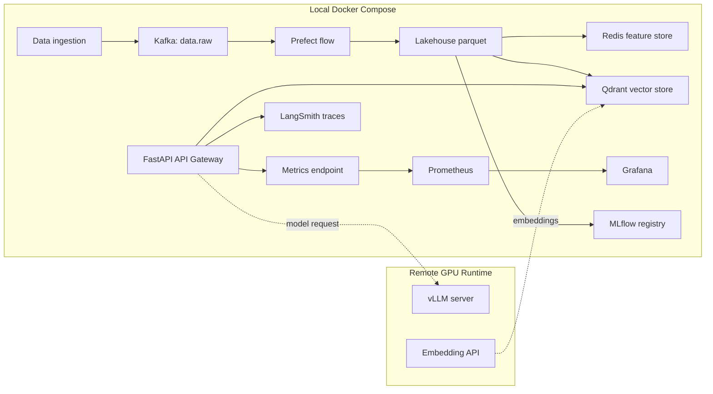

# Lab #28 - Full Platform Integration Sprint

**Sinh viên:** Thái Thị Yến Nhi  
**MSSV:** `2A202600783`

README này được viết để giáo viên chấm nhanh: xem output, hình demo, log kiểm chứng, kiến trúc, mapping Day 16 -> Day 27 và phần trả lời 5 câu hỏi nộp bài.

---

## 1. Bảng chấm nhanh

| Mục cần chấm | Link | Output chính |
|---|---|---|
| Source code | [`lab28/`](lab28/) | Full Docker Compose stack + scripts |
| Setup guide | [`lab28/README.md`](lab28/README.md) | Hướng dẫn setup và runbook |
| Kaggle GPU guide | [`KAGGLE_SETUP.md`](KAGGLE_SETUP.md) | vLLM + embedding service |
| Day 16 -> Day 27 | [`docs/day16-day27-integration-map.md`](docs/day16-day27-integration-map.md) | Cross-day lineage |
| Prefect UI | [`lab28/screenshots/prefect_ui.png`](lab28/screenshots/prefect_ui.png) | Flow/task completed |
| API Gateway | [`lab28/screenshots/api_gateway.png`](lab28/screenshots/api_gateway.png) | Health check OK |
| Grafana | [`lab28/screenshots/grafana_dashboard.png`](lab28/screenshots/grafana_dashboard.png) | Prometheus query `up` có data |
| Smoke tests | [`lab28/smoke_tests_results.png`](lab28/smoke_tests_results.png) | `8 passed` |
| Readiness | [`lab28/production_readiness.png`](lab28/production_readiness.png) | `14/14 = 100%` |

---

## 2. Output logs đã verify

### Real vLLM serving

```text
status: 200
model: Qwen/Qwen2.5-7B-Instruct-GPTQ-Int4
content: public tunnel works
```

Local API Gateway gọi real vLLM:

```text
latency_ms    : 2910.01
model         : Qwen/Qwen2.5-7B-Instruct-GPTQ-Int4
fallback_used : False
context_items : 3
error         :
```

### Embedding service -> Qdrant

```text
status: 200
embedding_count: 1
embedding_dim: 384
Embedding service OK: received 3 embeddings
Integration 5 OK: stored 3 vectors in Qdrant collection 'documents'
```

### Observability

```text
Integration 9 OK: Prometheus metrics flowing for API Gateway
Integration 10 OK: LangSmith traces visible in project lab28-platform
```

---

## 3. Hình ảnh demo

### 3.1 Prefect UI


### 3.2 API Gateway health


### 3.3 Grafana với Prometheus datasource


### 3.4 Smoke tests


### 3.5 Production readiness


---

## 4. Architecture



---

## 5. 10 integration points

| # | Requirement | Implementation |
|---:|---|---|
| 1 | Data ingestion -> Kafka | [`lab28/scripts/01_ingest_to_kafka.py`](lab28/scripts/01_ingest_to_kafka.py) |
| 2 | Kafka -> pipeline | [`lab28/prefect/flows/kafka_to_delta.py`](lab28/prefect/flows/kafka_to_delta.py) |
| 3 | Pipeline -> Lakehouse | Local parquet under `delta-lake/raw` |
| 4 | Lakehouse -> Feature Store | [`lab28/scripts/03_delta_to_feast.py`](lab28/scripts/03_delta_to_feast.py) |
| 5 | Data -> Vector Store | [`lab28/scripts/05_embed_to_qdrant.py`](lab28/scripts/05_embed_to_qdrant.py) |
| 6 | MLflow -> Model Registry | [`lab28/scripts/06_register_model_mlflow.py`](lab28/scripts/06_register_model_mlflow.py) |
| 7 | Model -> vLLM serving | [`KAGGLE_SETUP.md`](KAGGLE_SETUP.md) |
| 8 | Serving -> API Gateway | [`lab28/api-gateway/main.py`](lab28/api-gateway/main.py) |
| 9 | Components -> Prometheus/Grafana | [`lab28/monitoring/prometheus.yml`](lab28/monitoring/prometheus.yml) |
| 10 | Components -> LangSmith tracing | `lab28_chat_pipeline` trace |

---

## 6. Day 16 -> Day 27 lineage

Chi tiết đầy đủ ở [`docs/day16-day27-integration-map.md`](docs/day16-day27-integration-map.md).

| Day | Capability chính | Lab 28 kế thừa |
|---:|---|---|
| 16 | Cloud infrastructure, IaC, fallback design | Hybrid Local + remote GPU runtime |
| 17 | Data pipeline, streaming | Kafka -> Prefect -> Lakehouse |
| 18 | Lakehouse | Parquet lakehouse layer |
| 19 | Qdrant, Redis feature store | Vector store + online features |
| 20 | Model serving | OpenAI-compatible vLLM endpoint |
| 21 | MLOps, MLflow | Local MLflow registry |
| 22 | LangSmith, LLMOps | Chat pipeline traces |
| 23 | Observability stack | Prometheus + Grafana |
| 24 | Governance | Config-driven platform |
| 25 | GPU FinOps | GPU chỉ dùng khi live demo |
| 26 | Agentic routing | API Gateway as front door |
| 27 | Data defense | Smoke tests + readiness checks |

---

## 7. Hướng dẫn chạy nhanh

```bash
cd lab28
cp .env.example .env
docker compose up -d --build
```

Run pipeline:

```bash
python scripts/01_ingest_to_kafka.py
python prefect/flows/kafka_to_delta.py
python scripts/03_delta_to_feast.py
python scripts/05_embed_to_qdrant.py
python scripts/06_register_model_mlflow.py
```

Run checks:

```bash
pytest smoke-tests/ -v
python scripts/production_readiness_check.py
python scripts/09_verify_observability.py
```

Dashboards:

| Service | URL |
|---|---|
| API Gateway | http://localhost:8000 |
| API docs | http://localhost:8000/docs |
| Prefect UI | http://localhost:4200 |
| Qdrant | http://localhost:6333/dashboard |
| Prometheus | http://localhost:9090 |
| Grafana | http://localhost:3000 |

---

## 8. 5 câu hỏi cần trả lời

### 1. Trade-offs trong kiến trúc AI platform

Thiết kế ưu tiên reliability và maintainability trước, sau đó dùng remote GPU runtime để tăng performance khi cần live demo. Data platform chạy local bằng Docker Compose nên dễ reproduce. Model inference nặng được tách ra khỏi local machine. Trade-off là kết nối network có thể chậm hoặc mất, nên API Gateway có fallback path.

### 2. Hybrid Local + remote GPU xử lý disconnect như thế nào?

Local API Gateway gọi remote model serving endpoint. Nếu endpoint unavailable hoặc request timeout, API Gateway trả local fallback response thay vì crash. Khi real endpoint hoạt động, output có `fallback_used: False`; khi lỗi, output chuyển sang fallback mode. Đây là graceful degradation.

### 3. Kafka giúp decouple components như thế nào?

Kafka là event bus giữa ingestion và downstream processing. Producer chỉ publish events vào `data.raw`; Prefect, feature store, vector store hoặc các consumer tương lai có thể xử lý độc lập mà không cần sửa producer. Cách này giúp replay events và mở rộng pipeline dễ hơn.

### 4. Observability được implement như thế nào?

API Gateway expose metrics endpoint, Prometheus scrape metrics, Grafana visualize. LangSmith trace chat pipeline để xem latency, fallback usage và LLM call. Docker logs và script logs thể hiện trạng thái từng integration step như Kafka consumed records, Redis features stored, Qdrant vectors stored và MLflow model registered.

### 5. Nếu service crash thì xử lý thế nào?

Nếu remote model service down, API Gateway dùng fallback response. Nếu Qdrant, Redis hoặc Kafka down, readiness/production check báo lỗi dependency để operator xử lý. Core API và health endpoint được tách khỏi batch pipeline nên một lỗi downstream không làm toàn bộ platform mất kiểm soát.

---

## 9. Link nộp

```text
https://github.com/Lemin9802/Day28-Lab_2A202600783_Thai-Thi-Yen-Nhi
```
